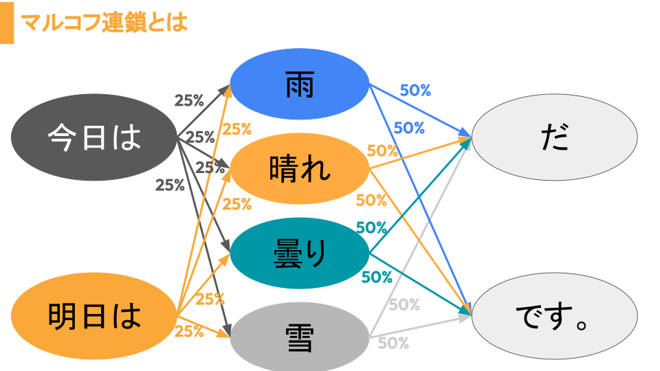
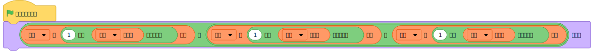

# Scratchでマルコフ連鎖を作ってみた
[Scratch](https://scratch.mit.edu)を使ってマルコフ連鎖を作ってみました。
## マルコフ連鎖とは

上のように、何%かの割合で、出るものが変わるものです。マルコフさん(ロシア,Андре́й Андре́евич Ма́рков,数学者)が確率過程論を考えました。
## マルコフ連鎖の作り方
実際に作ったもの[https://scratch.mit.edu/projects/956642705](https://scratch.mit.edu/projects/956642705)を見るとはやいですが、一応ブロックを使って説明します。
## 作り方
1.まず次のようなリストを作ります。
 -  sub
 -  pre
 -  now

2.リストの中に次の内容を入れます。

| sub |    pre    |   now  |
|:---:|:---------:|:------:|
|ぼくは|カレーライス|が好きだ  |
|私は  |りんご     |食べれる  |
|彼は  |いちご     |が嫌いだ  |
|先生は|バナナ     |を食べられる|
|     |メロン     |           |
|     |すいか     |           |

3.次のようなプログラムを作ります。

4.旗を押してみます
## その他
作ったプログラムをGitHub上にアップロードしておくので、時間がない場合はこちらをお使いください。
ライセンス:[CC BY SA 2.0](https://creativecommons.org/licenses/by-sa/2.0/)
